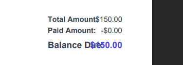
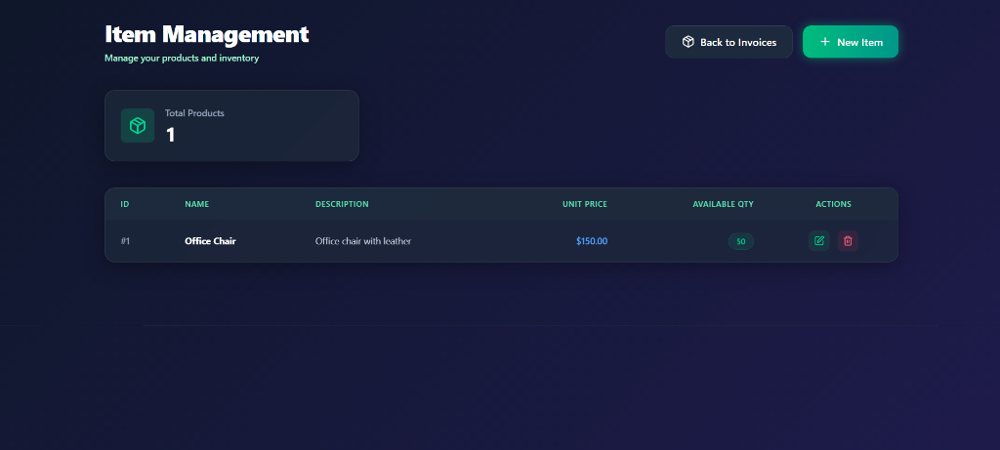
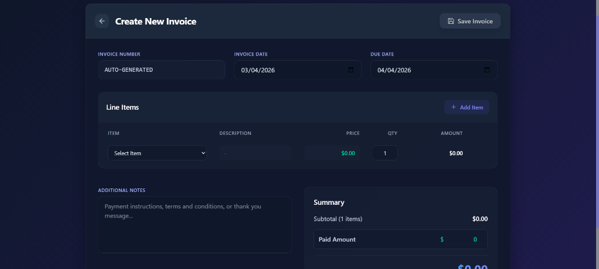
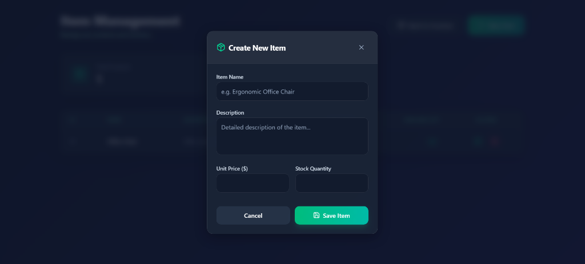

# NovaBill - Premium Invoice Management

A state-of-the-art, full-stack application for managing invoices, built with **ASP.NET Core Web API** and **React** featuring a stunning Glassmorphism dark-theme UI.

## 📸 Screenshots

### Main Invoice Dashboard


### Item Management Dashboard


### Create Item Modal


### Create Invoice Form


### Beautiful Programmatic PDF Exports


## ✨ Premium Features

- **Stunning UI**: Fully redesigned interface featuring a modern dark theme and glassmorphic panels.
- **PDF Export Capabilities**: Download your invoices directly as high-quality PDFs with a single click.
- **Interactive Dashboards**: Track total invoices, available balance, paid amounts, and totals with beautiful metrics.
- **Real-time Calculations**: Create invoices with instant math for quantities, prices, and balance dues.
- **Robust Tech Stack**: Powered by ASP.NET Core 8 on the backend and React 19 + Tailwind CSS on the frontend.

## 🛠️ Tech Stack

### Backend
- **ASP.NET Core 8.0 Web API**
- **Entity Framework Core**
- **PostgreSQL**
- **C# 12.0**

### Frontend
- **React 19 & Vite**
- **Tailwind CSS v4** (Custom Dark Glassmorphic Theme)
- **Lucide React** for highly aesthetic icons.
- **jsPDF & html2canvas** for real-time PDF generation.

## 📋 Prerequisites

- .NET 8.0 SDK
- Node.js 18+ and npm
- PostgreSQL 15+

## 🔧 Setup and Installation

### Backend Setup

1. Update the connection string in `NovaBill/appsettings.json`:
   ```json
   {
     "ConnectionStrings": {
       "DefaultConnection": "Host=localhost;Port=5432;Database=novabillDB;Username=your_username;Password=your_password"
     }
   }
   ```

2. Run database migrations:
   ```bash
   cd NovaBill
   dotnet ef database update
   ```

3. Run the backend API:
   ```bash
   dotnet run
   ```
   The API will be available at: `https://localhost:5179`

### Frontend Setup

1. Navigate to the client app:
   ```bash
   cd NovaBill-Frontend
   ```

2. Install dependencies:
   ```bash
   npm install
   ```

3. Run the frontend:
   ```bash
   npm run dev
   ```
   The app will be available at: `http://localhost:5173`

## 👥 Authors

- **Abdul Rafay Khan** 
